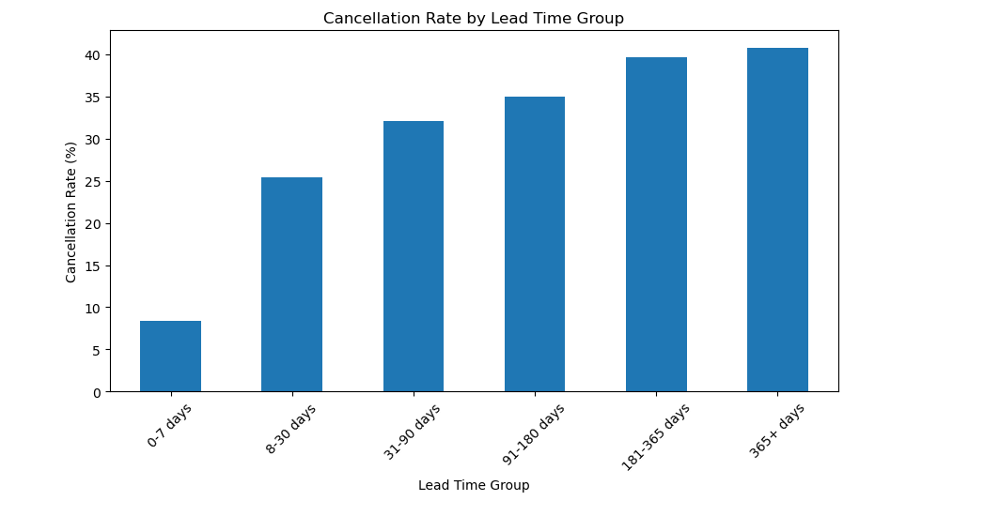
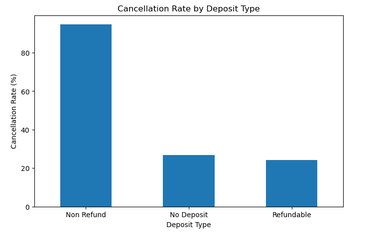
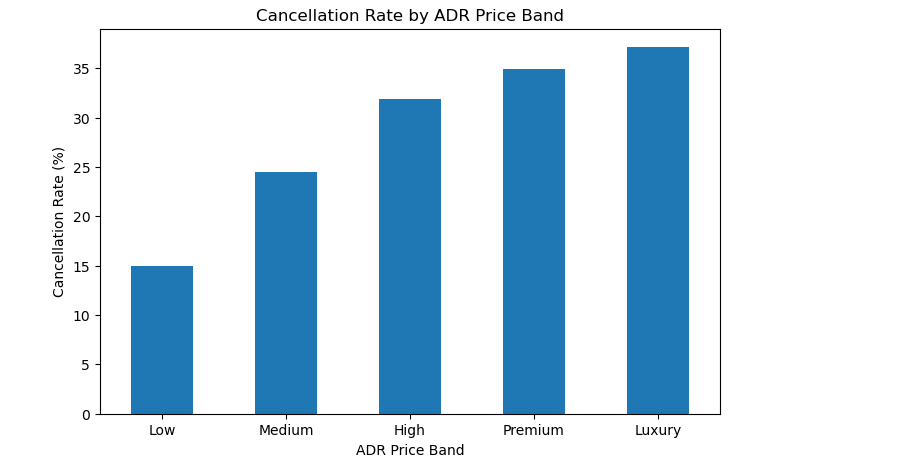
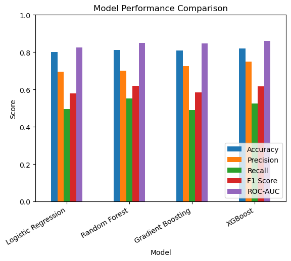
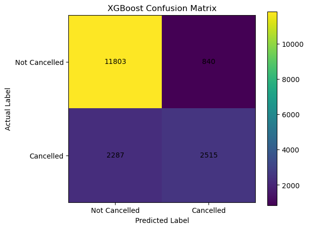
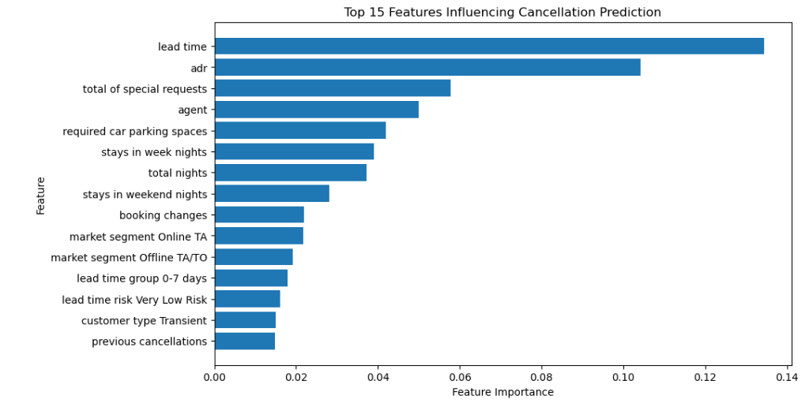

# Hotel Booking Cancellation Analysis

## Project Overview
This project analyses hotel booking cancellations using Python, exploratory data analysis, feature engineering, and machine learning. The goal is to identify key factors associated with booking cancellations and build a predictive model that can help estimate cancellation risk.

This project connects directly to front office and hospitality operations, where cancellations, booking behaviour, occupancy planning, and guest follow-up are important business areas.

## Business Objective
The objective of this project was to answer key business questions:

- What factors are most associated with hotel booking cancellations?
- Do lead time, ADR, customer type, market segment, and deposit type influence cancellation behaviour?
- Are returning guests less likely to cancel?
- Do special requests or booking changes indicate stronger guest commitment?
- Can machine learning predict whether a booking is likely to be cancelled?

## Dataset Source
The dataset used in this project is the Hotel Booking Demand Dataset.

Source: [Kaggle - Hotel Booking Demand Dataset](https://www.kaggle.com/datasets/jessemostipak/hotel-booking-demand)

The dataset contains hotel booking records including:
- hotel type
- lead time
- arrival date
- stay duration
- number of guests
- meal type
- country
- market segment
- distribution channel
- booking changes
- deposit type
- customer type
- ADR
- special requests
- cancellation status

## Tools Used
- Python
- pandas
- NumPy
- matplotlib
- scikit-learn
- XGBoost
- Jupyter Notebook

## Project Workflow
The project followed this workflow:

1. Data loading and initial inspection
2. Missing value handling
3. Duplicate removal
4. Feature engineering
5. Exploratory data analysis
6. Advanced cancellation analysis
7. Machine learning model building
8. Model comparison and evaluation
9. Business conclusion and recommendations

## Data Cleaning and Preparation
Key cleaning steps included:

- Filled missing values in `children`, `country`, and `agent`
- Dropped the `company` column due to a high number of missing values
- Removed duplicate booking records
- Removed invalid bookings with zero total guests
- Created a proper arrival date column
- Created new business-focused features for analysis and modelling

## Feature Engineering
New features created included:

- `total_guests`
- `total_nights`
- `arrival_date`
- `has_special_request`
- `has_previous_cancellation`
- `is_family_booking`
- `booking_party_type`
- `has_weekend_stay`
- `stay_length_group`
- `adr_group`
- `room_type_changed`
- `lead_time_risk`
- `has_previous_bookings`
- `has_booking_changes`
- `was_on_waiting_list`

These features helped make the analysis more business-focused and improved model input quality.

## Exploratory Data Analysis
Some of the exampples of EDA includes:

### Cancellation Rate by Lead Time Group
Bookings with longer lead times showed higher cancellation rates.

### Cancellation Rate by Deposit Type
Cancellation rates varied significantly by deposit type.

### Cancellation Rate by ADR Price Band
Higher ADR price bands showed higher cancellation rates.

## Key EDA Insights
- Bookings with longer lead times had significantly higher cancellation rates.
- Longer stays, especially 15+ night bookings, showed higher cancellation risk.
- Higher ADR price bands were associated with higher cancellation rates.
- Returning guests had a much lower cancellation rate than first-time guests.
- Guests with special requests appeared less likely to cancel.
- Bookings with changes showed lower cancellation rates, suggesting stronger guest engagement.
- Transient customers and online travel agency bookings showed higher cancellation risk.
- Cancellation rates varied by month, indicating seasonal cancellation patterns.

## Machine Learning Models
The target variable was:

`is_canceled`

Where:

- `0` = Not Cancelled
- `1` = Cancelled

The following models were tested:

- Logistic Regression
- Random Forest Classifier
- Gradient Boosting Classifier
- XGBoost Classifier

## Model Performance

| Model | Accuracy | Precision | Recall | F1 Score | ROC-AUC |
|---|---:|---:|---:|---:|---:|
| Logistic Regression | 80.10% | 69.45% | 49.48% | 57.79% | 82.63% |
| Random Forest | 81.23% | 70.21% | 55.27% | 61.85% | 85.09% |
| Gradient Boosting | 80.85% | 72.48% | 49.04% | 58.50% | 84.75% |
| XGBoost | 82.08% | 74.96% | 52.37% | 61.66% | 86.05% |

### Model Performance Comparison

### XGBoost Confusion Matrix

## Final Model Selection
XGBoost was selected as the final model because it achieved the best overall performance across the tested models. It had the highest accuracy, precision, F1-score, and ROC-AUC.

Random Forest achieved slightly higher recall, meaning it caught more actual cancellations, but XGBoost produced fewer false positives and better overall separation between cancelled and non-cancelled bookings.

## Feature Importance
The most important predictors of cancellation included:

- lead time
- ADR
- total special requests
- agent
- stay length
- booking changes
- market segment
- customer type
- previous cancellation history

## Business Recommendations
Based on the analysis and machine learning results:

- Long lead-time bookings should be monitored more closely because they showed higher cancellation risk.
- High ADR bookings may need proactive confirmation or follow-up.
- Returning guests appear more reliable and could be targeted through loyalty strategies.
- Bookings with no special requests may require additional engagement.
- Transient and online travel agency bookings should be considered higher-risk segments.
- The model can be used as a risk-screening tool to prioritise bookings for follow-up.

## Final Business Conclusion
This project showed how hotel booking data can be used to understand cancellation behaviour and predict cancellation risk.

The analysis found that cancellation behaviour was strongly influenced by lead time, ADR, customer type, market segment, deposit type, stay length, special requests, booking changes, previous booking history, and room assignment status.

From a business perspective, the model could help hotel front office and revenue teams identify high-risk bookings earlier. This could support better occupancy forecasting, targeted guest follow-ups, improved cancellation policy planning, and more informed operational decision-making.

The model should not replace human judgement, but it can be used as a decision-support tool to prioritise bookings that may need additional attention.

## Files Included
- `Hotel_Booking_Cancellation_Analysis.ipynb` — Jupyter Notebook containing data cleaning, EDA, feature engineering, and machine learning
- `hotel_bookings_cleaned_enhanced.csv` — cleaned and enhanced dataset
- `images/` — chart and model output images used in this README

## Skills Demonstrated
- Data cleaning
- Exploratory data analysis
- Feature engineering
- Data visualisation
- Classification modelling
- Model evaluation
- Business insight generation
- Hospitality analytics
- Machine learning interpretation
